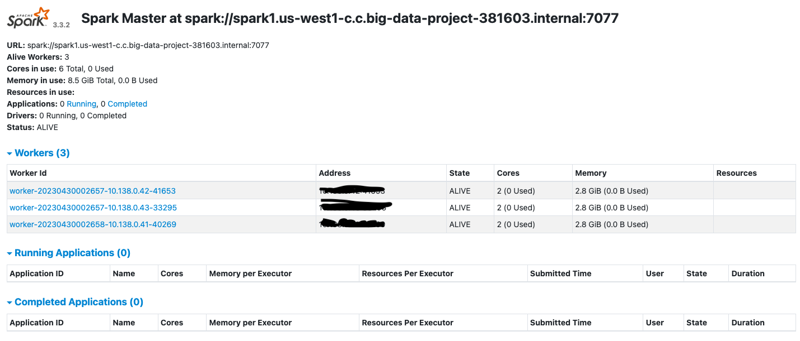

# Configuring Spark Cluster On GCP Compute (Multi-Node)

## Creating VMs
We have created three nodes with the below configuration


### Nodes:
<ul>
<li>spark1</li>
<li>spark2</li>
<li>spark3</li>
</ul>

### Configuration
<ul>
<li><strong>Disk Size: </strong>20 GB</li>
<li><strong>Operating System: </strong> Ubuntu Server 20.04</li>
<li><strong>Memory: </strong>4 GB</li>
</ul>


<hr>


## Installing Dependencies

Install Java On All Nodes

```
sudo apt update
sudo apt install openjdk-8-jdk
java -version
echo "export JAVA_HOME=/usr/lib/jvm/java-8-openjdk-amd64/" >> ~/.bashrc
source ~/.bashrc
```

Download Spark (All Nodes)
```
wget https://dlcdn.apache.org/spark/spark-3.3.2/spark-3.3.2-bin-hadoop2.tgz

tar xvf spark-3.3.2-bin-hadoop2.tgz
sudo mv spark-3.3.2-bin-hadoop2.tgz /usr/local/spark
echo "export PATH="$PATH:/usr/local/spark/bin"" > .bashrc
source .bashrc
```

## Configuring Spark

### Master Node (spark1)

```
cd /usr/local/spark/conf
cp spark-env.sh.template spark-env.sh
sudo nano spark-env.sh
```
Paste the below in spark-env.sh
```
export SPARK_MASTER_HOST="host.spark1.name"
export JAVA_HOME="JAVA PATH"
```
/conf/slaves
```
sudo nano slaves
```
Paste the host names of the nodes
```
spark1
spark2
spark3
```

## Start The Cluster
```
./usr/local/spark/sbin/start-all.sh
```
To Stop The Cluster
```
./usr/local/spark/sbin/stop-all.sh
```

## Spark UI
```
http://<MASTER-IP>:8080/
```


